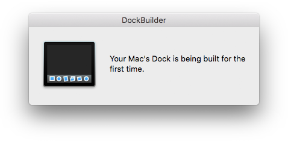

# DockBuilder
A LaunchAgent and .app to build a user's Dock upon login and/or on demand.

DockBuilder allows for the building of a user's Dock based on an organization's needs. DockBuilder eliminates the need for a user template which only allows for a static Dock for all users, and template manipulation can cause issues in newer versions of macOS. DockBuilder not only allows for easy creation of a new user's Dock out of the box, but also has the potential to dynamically set up a different Dock for users based on some criteria; like AD groups for example (you'd have to modify the source based on your criteria).

## Features
- Builds a Dock based on pre-defined defaults
- Includes a framework for building unique Docks for certain users based on some criteria (including an example)
- Logs to ~/Library/Logs/DockBuilder.log (by default)
- Does not start until the Dock.app is loaded upon login
- Only builds a Dock for user's who's Dock is younger than 300 seconds (to minimize re-building a pre-existing user's Dock after the installation of DockBuilder)
- Option to hide the Dock and display a message to the user while the Dock is being built

<p align="center">
    
</p>

## Requirements for Building
- [Platypus](https://sveinbjorn.org/platypus): A developer tool that creates native Mac applications from command line scripts such as shell scripts or Python, Perl, Ruby, Tcl, JavaScript and PHP programs.
    - You must install the command line tool associated with Platypus. Open Platypus, in the Menu Bar choose "Platypus" > "Preferences" and click the "Install" button to install the Platypus command line tool.
- jamfHelper: jamfHelper is used to display the message when the Dock is being built (if you choose to use that feature). CocoaDialog could also be leveraged pretty easily for environments without Jamf Pro. AppleScript could also be used, but you can't create an AppleScript dialog void of buttons.

*Note: [Dockutil](https://github.com/ryangball/DockBuilder#Dockutil) is also required, but included in the resulting .pkg and releases.*

## Build Project
To build new versions you can simply run the [build.sh](/build.sh) script and specify a version number for both the .app and .pkg. The resulting .pkg will include the LaunchAgent and .app as well as necessary preinstall/postinstall scripts. If you do not include a version number as a parameter then version 1.0 will be assigned as the default.
```bash
# Clone the repo and traverse into the created directory
git clone https://github.com/ryangball/DockBuilder.git
cd DockBuilder

# At this point you'd customize the variables in the build.sh script

# Build the .pkg
./build.sh 1.5
```

## Customize DockBuilder
Within the [build.sh](/build.sh) script, you can modify the top-most variables to create a custom DockBuilder .app and .pkg.

Some things to keep in mind:
1. Within both the breadcrumb and log variables, you'll notice the $HOME environmental variable. You should leave this in there as both should be in the user's home folder.
2. Within the defaultItemsToAdd array (and alternateItemsToAdd_1 if you use it), you need to follow the same pattern that I used in the example. When specifying view options for the persistent-others Dock items, you need to separate the Dock item and options with a comma (",") as per the example.
3. After modifying the variables in build.sh, please test for full functionality before deploying.
4. If you want to set up a unique Dock for certain users you must populate the alternateItemsToAdd_1 ion [build.sh](/build.sh) **and** modify [this logic in dockbuilder.sh](https://github.com/ryangball/DockBuilder/blob/e6c4bab519648bdcdc812293bdd0ad098a798cc9/dockbuilder.sh#L108-L119)) to include the users or criteria to build the alternate Dock.
5. If you want to exclude specific existing users from the initial breadcrumb creation so that they will get a new Dock created, you must populate the skipInitialBreadcrumbUsers variable in [build.sh](/build.sh).

## Testing
To test DockBuilder, install the .pkg, then unload/load/start the LaunchAgent.
```bash
# Delete the breadcrumb for the user if it exists
find ~/Library/Preferences -name com.github.ryangball.dockbuilder.breadcrumb.plist -delete

# Unload the LaunchAgent
launchctl unload /Library/LaunchAgents/com.github.ryangball.dockbuilder.plist

# Load the LaunchAgent
launchctl load /Library/LaunchAgents/com.github.ryangball.dockbuilder.plist

# Start the LaunchAgent (if necessary)
launchctl start com.github.ryangball.dockbuilder

# Tail the log to see what is occurring
tail -f ~/Library/Logs/DockBuilder.log
```

## Re-create a User's Dock
Upon DockBuilder's execution, a breadcrumb is placed into the user's home folder by default: ~/Library/Preferences/com.github.ryangball.dockbuilder.breadcrumb.plist

In the event that this breadcrumb exists for a user, DockBuilder will exit without any action. To re-create a user's Dock, open terminal as the user and run the following to remove the breadcrumb:
```bash
rm ~/Library/Preferences/com.github.ryangball.dockbuilder.breadcrumb.plist
```
Then you can simply run the /Applications/Utilities/DockBuilder.app or unload/load the LaunchAgent as per the [Testing](https://github.com/ryangball/DockBuilder#Testing) section above.

## Dockutil
[Dockutil](https://github.com/kcrawford/dockutil) is included in the resulting .pkg and is licensed under the [Apache 2.0](http://www.apache.org/licenses/LICENSE-2.0) license. Dockutil is automatically downloaded from the releases section when using the build.sh script, or included if you download one of the DockBuilder Releases.